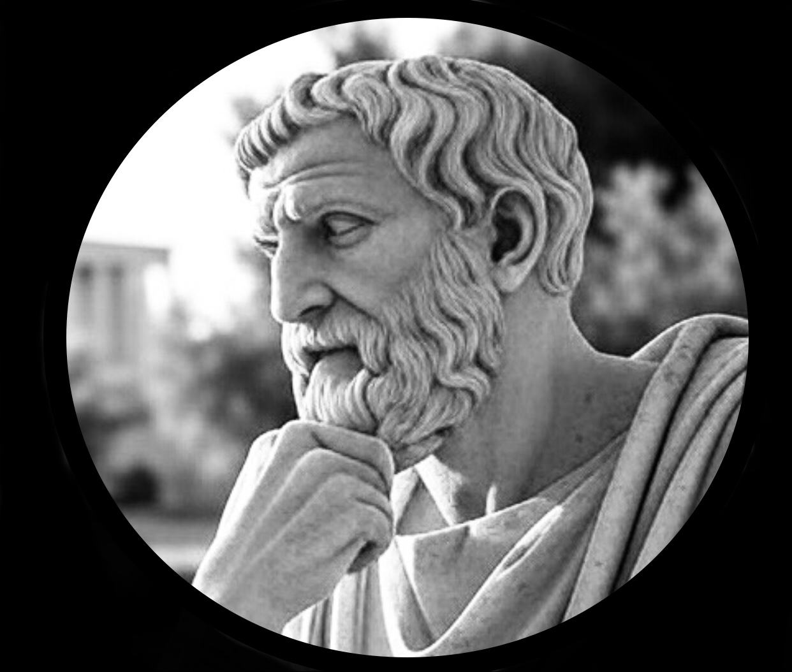
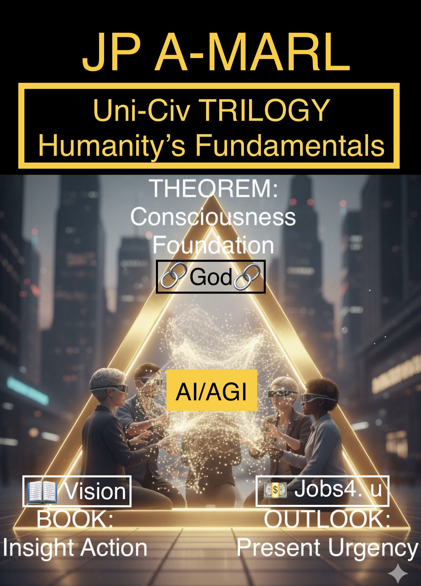
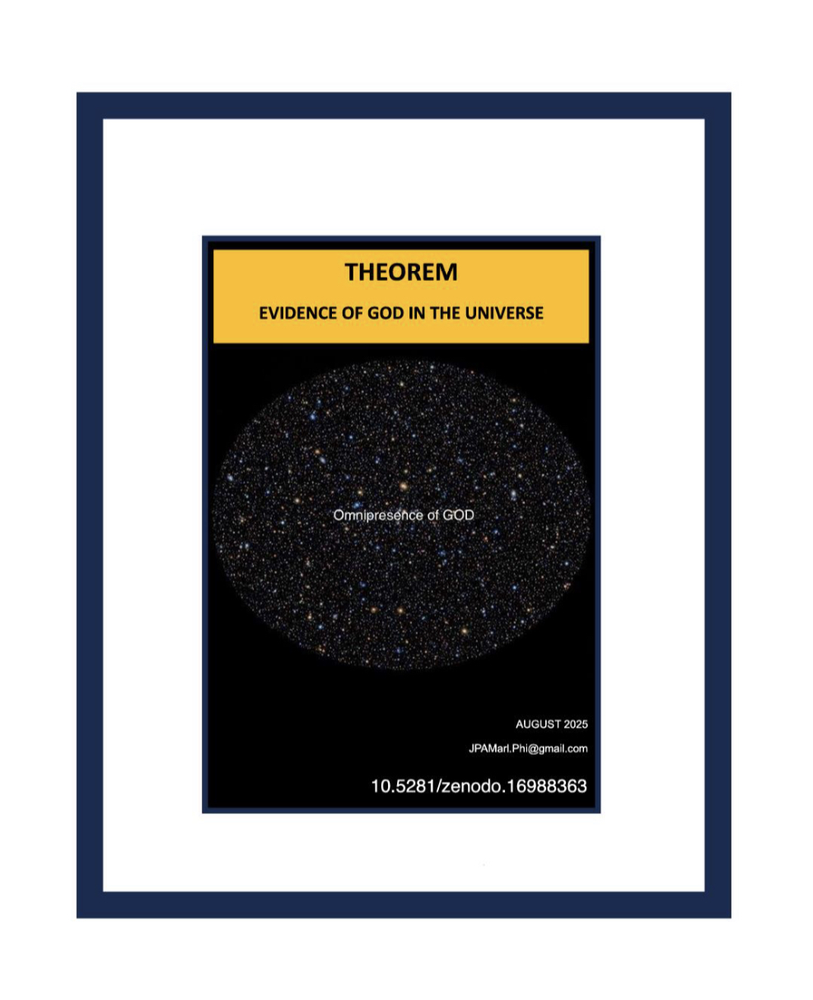
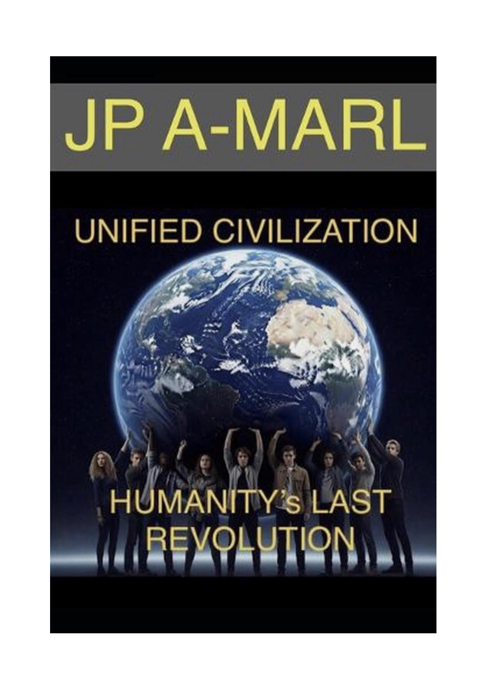

# Uni-Civ Trilogy

---
title: Home
layout: default
show_edit_link: false
---

Welcome to the official GitHub Pages site for the Uni-Civ Trilogy by JP A-Marl.

The Uni-Civ Trilogy is a curated collection of fundamentals authored by JP A-Marl to guide Humanity into a technological advanced new era of civilizational modeling and strategic foresight, with AI/AGI alignment.

These fundamentals are organized into three beacons:

📘 1. Theorem: Evidence of God in the Universe 
Explores metaphysical and scientific intersections, proposing that reality is an entangled information field with divine structure. Prompts in this section address consciousness, rationality, and moral architecture.

📗 2. Unified Civilization: Humanity’s Last Revolution 
Focuses on the leap from tribal identity to civilizational consciousness. Prompts challenge legacy geopolitical paradigms and advocate for a coherent species-level identity rooted in dignity and diversity.

📙 3. Strategic Outlook: Preparing for AGI and Automation 
Addresses the socioeconomic impact of automation and AGI. Prompts call for strategic reskilling, policy foresight, and ethical preparedness in the face of technological disruption.

Explore the full text and philosophical framework:
[HuggingFace Dataset](https://huggingface.co/datasets/jpamarlphi-byte/Uni-Civ-Trilogy)

Dive into the Prompt Pack:
[Prompt Pack](https://huggingface.co/datasets/jpamarlphi-byte/Uni-Civ-Trilogy-Prompts)

Follow the journey:
- [Medium](https://medium.com/@jpamarl.phi)
- [Reddit](https://reddit.com/r/unifiedcivilization)
- [YouTube](https://youtube.com/@jpa-marl)
- [TikTok](https://tiktok.com/@jp.amarl3)

